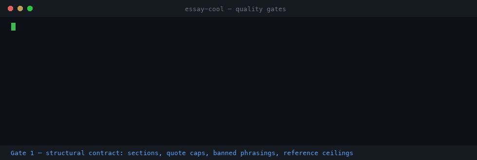

# essay-cool

[](https://github.com/succtorlin/essay-cool/stargazers)
[](https://github.com/succtorlin/essay-cool/actions/workflows/gates.yml)
[](LICENSE)
[](https://www.python.org/)
[](gates/)

**The quality gates that came out of turning three books into an AI skill pack — and the blocker they found.**



*Real output from `examples/demo` — the clean card passes all three, the broken card fails each for a different reason. Reproduce it in under a minute: [Install](#install).*

`essay-cool` was a distillation project: take three books on college application essays, extract the methodology, compile it into installable agent skills. An LLM wrote 19 capability cards. Structural validation passed. Schema validation passed. The official packager reported `0 errors, 0 warnings`.

The flagship skill was **unexecutable**. It instructed the reader to audit 26 items, demanded a 26-row output table, set its completion standard at "all 26 judged" — and never contained the 26 items. A clean executor could produce at most 16 rows. One item existed nowhere in the package at all.

Every static check was green. None of them asked *"can anyone actually run this?"*

This repo is what the project left behind: the three gates that found that, plus two others that caught a fabricated-looking quotation and five quotations credited to the wrong named human being.

```
quote fragments checked: 272 | untraceable: 0
attributed quotes checked: 62 | MISATTRIBUTED: 0
19 files, 0 violations
```

**The gates are source-agnostic.** Nothing here is specific to essays, or to any subject. Point them at whatever you generate from whatever sources. The essay project is only where they were forged — and the reason the README can tell you exactly which defects they catch in the wild rather than in theory.

> **No content from the source books is in this repository.** The distilled skills stayed private; only the tooling and the method are here. The demo uses a synthetic source written for this repo.

---

## Why this exists

If you generate anything substantial from source documents — agent skills, capability cards, research briefs, documentation, training material — you have three failure modes that normal validation cannot see:

| Failure | What it looks like | What catches it |
|---|---|---|
| **Invented evidence** | A quotation that reads perfectly and appears nowhere in the source | `verify_quotes.py` |
| **Wrong speaker** | A real quotation credited to the wrong person | `verify_attribution.py` |
| **Unexecutable output** | Passes every structural check; cannot be followed | `check_contract.py` + an execution test |

Schema validators check shape. Linters check syntax. Neither checks whether the words are *true of the source*, or whether the instructions *can be carried out*.

---

## Install

No dependencies. Python 3.8+.

```bash
git clone https://github.com/succtorlin/essay-cool
cd essay-cool
```

Run the demo — it ships a synthetic source and two cards, one clean and one with three planted defects:

```bash
cd examples/demo
python3 ../../gates/check_contract.py    --artifacts 'cards/*.md' --contract contract.json
python3 ../../gates/verify_quotes.py     --artifacts 'cards/*.md' --sources 'sources/*.txt' --header 'BRIDGE INSPECTION HANDBOOK'
python3 ../../gates/verify_attribution.py --artifacts 'cards/*.md' --sections sections.json --names Okonkwo Raman
```

Expected: `good-card.md` passes all three. `broken-card.md` fails each one for a different reason.

---

## Gate 1 — `verify_quotes.py`: did the source actually say this?

Traces every quotation in your artifacts back to the source text. Catches fabrication, and — more usefully — catches **plausible paraphrase dressed as quotation**, which is the far more common LLM failure.

```bash
python3 gates/verify_quotes.py \
  --artifacts 'cards/*.md' \
  --sources 'corpus/*.txt' \
  --header 'My Book Title'
```

Tested against mixed input:

```
quote fragments checked: 3 | untraceable: 2
  UNTRACEABLE  mixed.md   Industry consensus holds that a thorough first pass requires no fewer than three...
  UNTRACEABLE  mixed.md   A photograph without a scale reference is merely anecdotal rather than evidential.
```

The first is invented outright. **The second is a faithful paraphrase of something the source really says** — defensible as a summary, indefensible inside quotation marks. The third quote, a real one, traced fine.

### The hard part is not string matching

Real sources are OCR'd scans. Naive `grep` fails on all five of these, and they are not hypothetical — every one came from production text:

| Corruption | Example | Effect |
|---|---|---|
| Intra-word spaces | `ar e writing` | `grep "are writing"` → 0 hits |
| **Glyph confusion** | scans render **capital I as `1`**, O as `0` | `1 used to give a talk` |
| Smart quotes | `don't` vs `don’t` | silent miss |
| **Page furniture mid-sentence** | `of this 139 <<<PAGE 154>>> Book Title essay is` | severs the sentence |
| Author-side elision | `"A … B"` | neither half matches whole |

On one scanned book, a raw `grep -c` for a common two-word phrase returned **23**. Whitespace-normalized, the true count was **100** — a **4.3× undercount**. Any frequency claim built on the raw number is wrong.

> **The non-obvious bug, if you build this yourself:** cleanup order matters. A running header is the *anchor* for locating the page number printed next to it. Strip the header first and you orphan a digit in the middle of a sentence, severing quotes that span a page break. They must be removed in one pass.

### A trap I walked into

My first version flagged **121 false positives**. The glyph normalization (`1`→`i`) was mangling digits in the artifacts' own citation markup — `#14` became `io`, poisoning every probe.

Fix: extract quote *interiors* only, never the whole line with its citation prefix. The lesson generalizes — **normalize the source and the claim with the same function, but only over the text that is actually quoted.**

---

## Gate 2 — `verify_attribution.py`: is it the right person?

Gate 1 confirms a quote is *in* the source. It cannot tell you it is credited to the right human. This gate does.

```bash
python3 gates/verify_attribution.py \
  --artifacts 'cards/*.md' --sections sections.json \
  --names Okonkwo Raman
```

```
WRONG SPEAKER  broken-card.md  claims Raman  actual=Okonkwo  "A crack without a ruler beside it is an anecdote, not a measurement."
```

### The trap it exists for

In interview and Q&A material, **a speaker's biography is often printed at the END of their section.** Any intuition that "the text near this bio belongs to this person" shifts every quotation by one speaker.

This gate found **5 real misattributions** in otherwise careful work. The worst had been promoted to a governing project-wide principle, credited to the wrong person.

Finding the boundaries honestly needs **two independent signals**:

1. **Bio positions.** If a Q&A begins before the first bio, bios must be at section *ends*.
2. **First-person institutional references.** A line like *"Unlike many teams, Riverside begins at the bearings"* must fall inside the Riverside person's section. (That exact sentence is in the demo source — the signal is real and you can watch it work.)

When the two agree, you have your boundaries. When they disagree, don't guess — read the chapter.

> **The correction made the evidence stronger.** The misattributed quote was the *prohibition* half of a rule ("no line-by-line editing"). Fixing it revealed the *permission* half belonged to a different officer at a different institution — two independent people closing the same boundary from opposite ends. Better evidence than the error had been.

---

## Gate 3 — `check_contract.py`: declarative structural contract

```bash
python3 gates/check_contract.py --artifacts 'cards/*.md' --contract contract.json
```

Checks required sections and their order, quote-length caps, clauses that must survive into every artifact, banned phrasings, conditional requirements, and **numeric reference ceilings** — which is how you catch a card citing "item #43" of a 26-item list.

Two design details worth stealing:

- **`banned_unless_negated`.** An artifact may legitimately *prohibit* a phrasing: *"never write 'experts agree'"*. A naive ban flags that as a violation. My first run produced two such false positives. The gate now checks for a negation in the preceding context.
- **Quote caps measure interiors.** Counting the citation prefix against an author's word quota produces phantom violations.

### ⚠ A green result here means less than you think

**All three static gates passed on the unexecutable skill.** Static conformance and executability are different properties. This gate is necessary and nowhere near sufficient.

---

## The gate that is not a script

The blocker was found by **executing** the artifact, under one constraint that made all the difference:

> **Give the executor the artifact and nothing else.**

With access to neighbouring files, a capable executor *patches the gap* — it finds the missing 26 items elsewhere in the package, produces a plausible result, and the card's insufficiency stays hidden. Forbid that, and the file either stands on its own or doesn't.

The re-test after the fix is the clean version of the result:

> *"26/26 judgeable. I never read another file."*

And it still produced a precise root cause for what remained:

> *"Three items depend on facts the input list does not collect."*

That one gap made the mandatory first step unexecutable and the completion standard unreachable. No static gate can see it. See [`docs/METHODOLOGY.md`](docs/METHODOLOGY.md) for the full harness.

---

## What the full run found

Static gates, after fixes: **19 artifacts, 0 violations · 272 quote fragments, 0 untraceable · 62 attributions, 0 wrong.**

Blind routing tests across three rounds: **49/49**, then 13/14 under a stricter rule that exposed 4 description defects, then **6/6 with zero inference** after fixes.

Blind execution: **1 blocker + 12 defects**, including a taxonomy declared mutually exclusive whose classes co-occur, two numeric gates that **pass on emptiness**, a heuristic that inverts on real input (5 adjectives vs 14 nouns, yet the most abstract paragraph — because the nouns were bare credentials), and a capability that cannot complete non-interactively while its input spec implied otherwise.

**Transferable findings:**

1. **Static conformance ≠ executability.** Budget for an execution test.
2. **Isolate the executor.** Access to siblings masks insufficiency.
3. **In routing descriptions, negative pointers outperform positive ones.** Four sibling discriminations resolved purely on *"not me → sibling X"* lines. The losing skill naming the winner is what made boundaries hold.
4. **Mutual exclusivity claims are usually false.** Every "exactly one of four" taxonomy met real input that hit three.
5. **Countable gates can be gamed by emptiness.** A concept can appear at 43% and be abandoned; the gate measures position, not development.

---

## Using these on your own project

1. Write a `contract.json` (start from [`templates/contract.example.json`](templates/contract.example.json)).
2. Declare speaker sections in `sections.json` if your sources have attributed speech — find boundaries with two independent signals.
3. Wire all three into CI. They exit non-zero on violations.
4. **Add an execution test.** Hand the artifact to a fresh agent, forbid every other file, and ask: *could you complete this, and what was ambiguous, contradictory, or impossible?* That last question finds more than the scripts do.

```yaml
- run: python3 gates/check_contract.py    --artifacts 'cards/*.md' --contract contract.json
- run: python3 gates/verify_quotes.py     --artifacts 'cards/*.md' --sources 'corpus/*.txt'
- run: python3 gates/verify_attribution.py --artifacts 'cards/*.md' --sections sections.json --names A B
```

## Scope

These gates check **fidelity to a source** and **structural conformance**. They do not check whether the source is any good, whether its claims are true, or whether the advice works. Those are different problems.

## About the name

`essay-cool` is the name of the distillation project that produced these tools, not a description of what they do. The gates are general-purpose; the demo is deliberately set in an unrelated domain (bridge inspection) so that no third-party content ships with the repo. If you arrived looking for essay-writing software, this is a verification toolkit — the part of that project that generalizes.

## License

MIT — see [LICENSE](LICENSE).
